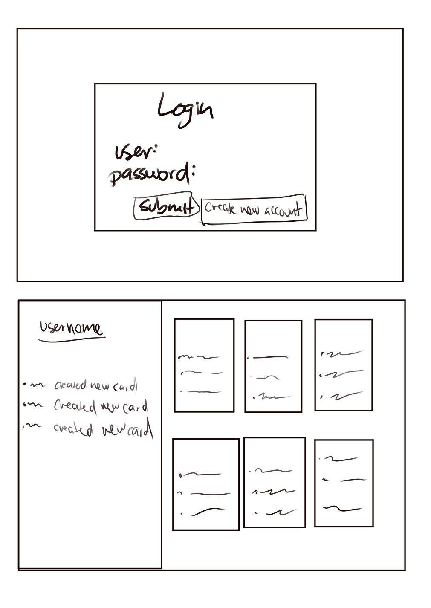

# startup

[Notes](notes.md)

### Personal Notes: I know I don't have a lot of commit spread out for this part of the project, i knoew and I promise to do better specially now that we are incorporating css and java script in the future. Just to let you know that I am aware and ill try to change my work ethic throughout the proyect. 

# Idea pitch

If you are someone creative and enjoys character creation, it might be hard to know how many characters you have and their information. My idea is to make it possible for people to create a gallery of *cards* that hold the information of characters to make it easier to organize and visualie to  you. 

## Design

Idea design for website

## Key Features

- Secure Login over HTTPS.
- Ability to create and delete character cards.
- Ability to edit character cards informtion.
- Ability to do basic costumatization on cards.
- Ability to show when another user has created a character card.

## Technologies

- HTML: Uses correct HTML structure. Includes two pages: one for login and one including the character gallery (this might change in the future)
- CSS: Uses valid CSS and preferably will include a responsive design
- Javascript: Provides login, complex design things that cannot be done with pure css, and backend endpoints. (this might change in the future)
- Service: Backend endpoitns for: 
    * Login
    * Getting data for cards
    * Notifiying if new character was created by someone
- DB/Login: Store, register, and login users. Credentials securly stored in database. Can't create character cards unless authenticated
- React: Application Uses Reach framework

## HTML

Structure of program is form by:

- HTML pages for each component of your application: Implemented in the shapes of index.html, deck.html, about.html, and updates.html - DONE
- Proper use of HTML tags including BODY, NAV, MAIN, HEADER, FOOTER - DONE
- Links between pages as necessary - DONE
- Application textual content: In the shape of card component, about.html and updates.html - DONE
- Character Card component: structure to hold the basic description of character - DONE
- Placeholder for 3rd party service calls: There are two posible places. What I really want i to have a third party service in order to have icons that can be put in the card as an image in place of the dog icon. If that can't be done then there is a place in the about.htlm where I could implement a call to a third party in order to get quotes — DONE
- Application images: In the chape of the image in the card component in the deck.html page - DONE
- DB/Login: input and submit button for login - DONE 
-  Database data placeholder showing content stored in the database: In the shape of the deck.html wehre the database will save the cards of the user - DONE 
- Websocket: displays if other users have submited a character - DONE

## CSS

Stylizitation of page is form by:

- selected color pallet for webpage - to have consistent look - DONE
- Responsive design - web respons to diferent window sizes (Desktop, mobile, and tablet) - DONE 
- Typography - Clear and redable fonts with appropirate spacing between font letters, lines, and whitespaces - DONE 
- Style consistancy - Make code and webpage apperiance be consistent. Make design be clear and simple for the User - DONE
- Styles for Header, footer, and main content body - DONE 
- Navigation elements (idk what this was talking about but there is a nav bar that is stylized using bootstrap) - DONE 
- Application elements in the form of the cards in the deck.html - DONE 
- Application text content in about.html and cards content in deck.html - DONE 
- Application images in about.html - DONE 

## Javascript

Honestly this is a work in progress. I need to learn more javascript to know how to use it in the project but this is an idea:

- login - onece you login you enter the character gallery - DONE
- database - save the data of the cards of the user - DONE (note: literally it is saving the data in local storage. When you refresh the page though, the cards disappear from the deck but the data IS still in local storage.  
I just need to implement a function to load them back :D However it is all buggy so I still need to fix this part. But hey kind of works)
- Websocket - shows when another user has created a character card - DONE
- Application logic - creating the cards - DONE 

## Service Deliverance

- Node.js/Express HTTP service - Not started
- Static middleware for frontend - Not started
- Calls to third party endpoints - Not started
- Backend service endpoints - Not started
- Frontend calls service endpoints - Not started

## DB/Login

- MongoDB Atlas database created - Not started
- Stores data in MongoDB - Not started
- User registration - Not started
- existing user - Not started
- Use MongoDB to store credentials - Not started
- Restricts functionality - Not started

## WebSocket deliverance

- Backend listens for WebSocket connection (by using the peerProxy given in simon.)- DONE
- Frontend makes WebSocket connection (Both in updates.js and deck.js) - DONE
- Data sent over WebSocket connection (From deck.html/js to updates.html/js)-  DONE
- WebSocket data displayed (in updates.html)(However this is buggy cuz it says the wrong name but I'll fix this) - DONE

## React Deliverance 

- Bundled and transpiled -  Not started
- Components -  Not started
- Router - Not started
- Hooks -  Not started